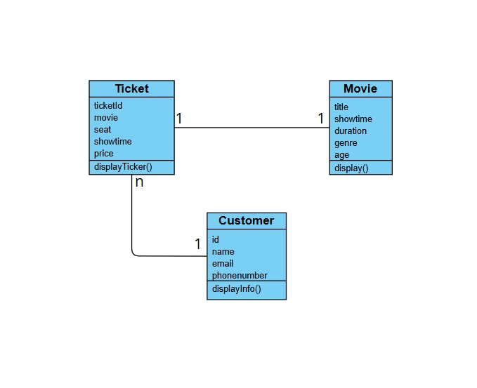

# Cinema Ticket Booking - Nhóm 6

## Thành viên nhóm
- Hoàng Văn Độ - 23010581  
- Nguyễn Tiến Doanh - 23010472  
- Dương Thiện Hùng - 23010601  
- Nguyen Le Thu

---

## Mô tả dự án

**Cinema Ticket Booking** là hệ thống bán vé xem phim trực tuyến, xây dựng bằng **Java Spring Boot**. Ứng dụng hỗ trợ quản lý phim, phòng chiếu, vé, khách hàng, và các chức năng đặt vé, thanh toán, in vé.

---

## Chức năng chính

- **Quản lý phim:**  
  - Thêm, sửa, xóa phim  
  - Hiển thị thông tin phim

- **Quản lý phòng chiếu:**  
  - Thêm, sửa, xóa phòng  
  - Hiển thị danh sách phòng

- **Quản lý vé:**  
  - Thêm, sửa, xóa vé  
  - Hiển thị thông tin vé

- **Quản lý khách hàng:**  
  - Thêm, sửa, xóa khách hàng  
  - Hiển thị thông tin khách hàng mua vé

- **Đặt vé, thanh toán, in vé tự động**

---

## Mô hình đối tượng

1. **Movie** (Phim)
   - *Thuộc tính:* title, showTime, duration, genre, age
   - *Phương thức:* display

2. **Customer** (Khách hàng)
   - *Thuộc tính:* id, name, phone, email
   - *Phương thức:* displayInfo

3. **Ticket** (Vé)
   - *Thuộc tính:* id, movieId, customerId, ticketPrice, seatNumber, status
   - *Phương thức:* displayInfo

4. **Room** (Phòng chiếu)
   - *Thuộc tính:* id, name, seatCount, type
   - *Phương thức:* displayInfo

---

## Công nghệ sử dụng

- Java 17
- Spring Boot 3.x
- Thymeleaf
- MySQL
- Maven

---

## Hướng dẫn chạy dự án

1. Clone repo:
   ```
   git clone https://github.com/Rumnn/OOP_N01_Term3_2025_K17_Group6
   ```
2. Cài đặt MySQL, tạo database và cấu hình kết nối trong `application.properties`.
3. Build và chạy ứng dụng:
   ```
   cd springbootApp/complete
   mvn spring-boot:run
   ```
4. Truy cập ứng dụng tại:  
   ```
   http://localhost:8080/
   ```
   (hoặc domain Codespaces nếu dùng cloud IDE)

---

# users (1) ←→ (N) bookings (1) ←→ (N) tickets
#   ↓                                    ↑
#   ↓                                    ↑
# (N) tickets ←→ (1) showtimes (1) ←→ (N) bookings
#               ↑
#               ↑
# movies (1) ←→ (N) showtimes (1) ←→ (N) rooms (1) ←→ (N) seats

## Hình ảnh & sơ đồ

### 1. Class Diagram


### 2. Activity Diagram


### 3. Lưu đồ thuật toán


### 4. Giao diện thêm phim


### 5. UI vé sắp chiếu


---

## Liên kết

- [GitHub Repo](https://github.com/Do17032005/OOP_N01_Term3_2025_K17_Group6)
- [README.md trên GitHub](https://github.com/Do17032005/OOP_N01_Term3_2025_K17_Group6/edit/main/README.md)

